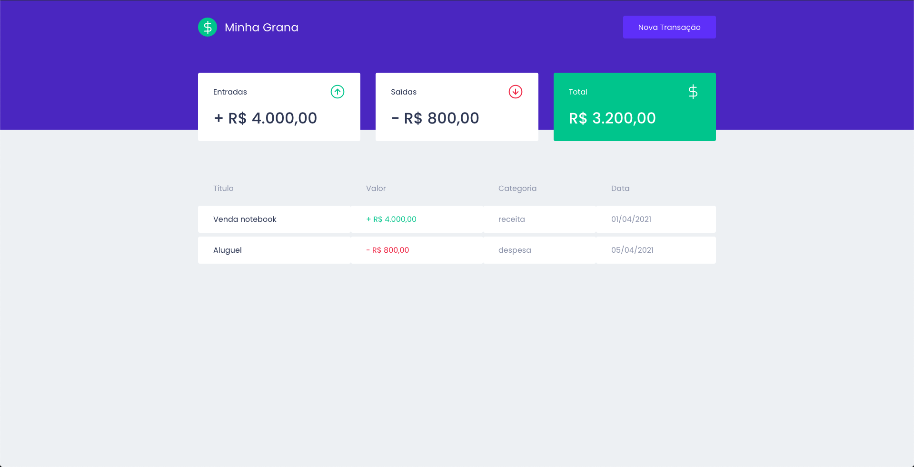
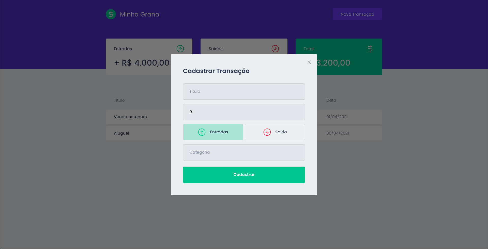

<br />
<p align="center">
  <a>
    
  </a>
</p>

<p align="center">
  A simple project of personal finances. Built with ReactJS, TypeScript, Styled Components and MirageJS
</p>

<p align="center">
  <a>
    
  </a>

  <a>
    
  </a>
</p>

## Table of Contents

- [Features](#features)
- [Screenshots](#screenshots)
- [Technologies](#technologies)
- [Installation](#installation)
- [Feedback](#feedback)

## Features

- Table with personal finance data with name, amount, category and date.
- Summary cards with incomes, outcomes and total.
- Button that Create a new transaction using a beautiful modal.

## Screenshots

<p align="center">
  
</p>

<p align="center">
  
</p>

## Technologies

- [React](https://pt-br.reactjs.org/)
- [TypeScript](https://www.typescriptlang.org/)
- [MirageJS](https://miragejs.com/)
- [Polished](https://polished.js.org/)
- [Axios](https://github.com/axios/axios)
- [Styled Componensts](https://styled-components.com/)

## Installation

First of all, you may clone this repo

```
  git clone https://github.com/leandrocanabarro/my-money.git
```

Run the following scripts in order to execute the project in development mode

```
  // Install the dependencies
  yarn install

  // Start the project
  // yarn start
```

## Feedback

Feel free to send me feedback on [LinkedIn](https://linkedin.com/in/leandrocanabarro) or [file an issue](https://github.com/leandrocanabarro/my-money/issues/new). Feature requests are always welcome.
